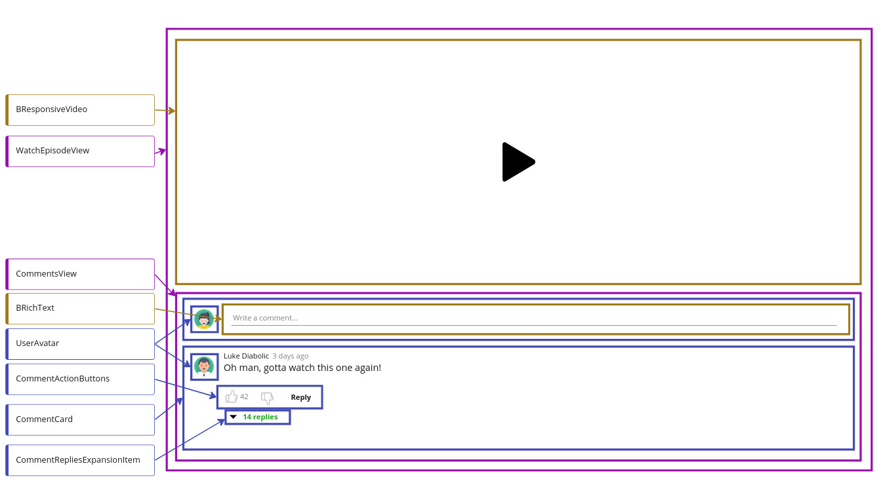

# Whiteboarding Colors
When whiteboarding components, we use colors to help us distinguish between **views**, **module components** and **base components**

- views are purple
- module components are blue (usually the most common)
- base components are brown

