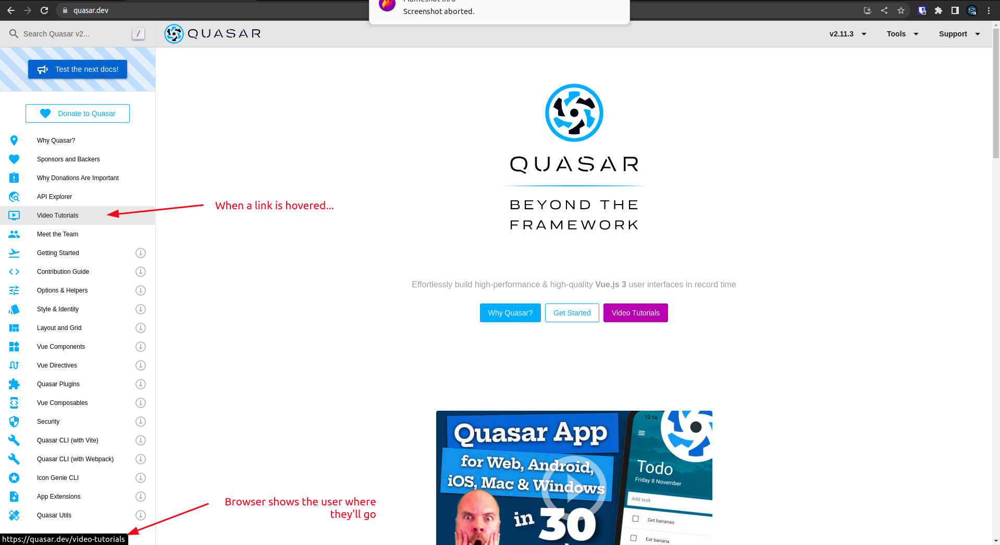

# Understanding The Architecture
To learn how to be a stitcher, you need a broad knowledge of our architecture, and **must deeply understand what can/can't be done at each layer.** More on that further down the page.

> Stitchers must deeply understand what can/can't be done at each layer

You may notice that any component that can make backend requests, also has global state knowledge. This is because just about every backend requests will result in global state. For example, when we fetch `Post`s with our `useFetchResources` composable, it always puts those `Post`s into global state (unless we explicitly tell it not to).

## Application layers
> IMPORTANT: You can safely ignore the first 6 steps (focus on the ones in bold). So you're aware of the broader picture, **service providers** are a flexible way of "taping in" to the app before it's loaded. This is used by architects and artisans, so you can safely ignore them for now.

Here are the layers of an app using our architecture (focus on the ones in bold):
1. all service providers `provide` functions in order (can be async)
2. service providers `boot` functions in order (can be async)
3. service providers `setup` functions in order (**cannot** be async)
4. `App.vue`
5. route enter hooks (can be async) including:
   1. route params
   2. route search query
6. **layout**
7. **page**
8. **view/s**
9. **leaf components**

> note: sometimes components will have views within them

## Application Layer Rules
These rules create layers of knowledge, and are the magic behind this entire architecture. If you follow them, we'll be able to build applications that scale!

### Layouts
#### Can
- make backend requests
- have knowledge of the current route (`useRoute()` and `useRouter()`)
- have knowledge of global state (`useRepo()`, `useResourcesFetcher()`)

#### Cannot
-  DO NOT Flood the view with too many lines of code. Make sure you're dilligently extracting components.
```vue
<script setup lang="ts">
const loginService = useLogin()
const logoutService = useLogin()
</script>

<template>
  <q-layout>
    <MainHeader
      @login="loginService.login()"
      @logout="logoutService.logout()"
      :logging-in="loginService.loggingIn.value"
      :logging-out="logoutService.loggingOut.value"
    />
    <MainDrawer />
  </q-layout>
</template>
```

**Note**: We would put the header and drawer in the layouts directory because they are "single context components"
```
📂 layouts
  📂 MainLayout
    - MainLayout.vue
    - MainHeader.vue
    - MainDrawer.vue
```

### Pages
Pages almost always contain views. They usually just pass route information to the view. In the route, we use `props: true` which means usually, even the page has no knowledge of the current route!

`ShowPostPage.vue`
```vue
<script setup lang="ts">
interface Props {
  postId: string
}

defineProps<Props>()
</script>

<template>
  <q-page padding>
    <ShowPageView :post-id="postId" />
  </q-page>
</template>
```
The example above is **key** to our architecture. Our `ShowPageView.vue` is getting the `postId` from the route, but it can **get the `postId` from anywhere**. For that reason, our `ShowPageView.vue` is no coupled to the route. And for that reason, it could exist in a modal, within a tab panel or even on a page that shows more than one post.

#### Can
- make backend requests (but rarely should, backend requests usually happen in the view)
An example of a page that makes backend requests? If the page had tabs that exist on the backend:
```vue
<script>
const tabsFetcher = useFetchResources(Tab, { immediate: true })
const selectedTab = ref<Tab | undefined>()
</script>

<template>
  <q-page>
    <view-tabs
      :tabs="tabsFetcher.repo.all()"
      v-model="selectedTab"
    />
    <RenderTabView
      v-if="selectedTab"
      :key="selectedTab.id"
      v-bind="selectedTab.data"
    />
  </q-page>
</template>
```
- have knowledge of global state

#### Cannot
- Have knowledge of the route (`useRoute` and `userRouter`). Why? Because we can use `props: true` [on the route](https://router.vuejs.org/guide/essentials/passing-props.html#passing-props-to-route-components) to automatically send the routes prop to the page. Therefore, knowledge of the router is completely unecessary.
- get bloated. Pages should almost always be tiny! Why? Because when used correctly, they have very few responsibilities which are:
  - proxy data from the route to views (or in some cases, this might be another source like local storage)

There are rare ocassions when a page will get complex. For example, when the page is displaying multiple views that need to communicate to oneanother. In this case, we may need a little more logic in the page:

`ShowEpisodePage.vue`
```vue
<script lang="ts" setup>
interface Props {
  courseId: string
}

const props = defineProps<Props>()

// We use `toRef` to maintain the courseId's reactivity
const courseService = useCourseService({ courseId: toRef(props.courseId) })
const selectedEpisode = ref<Episode>()
</script>

<template>
  <q-page>
    <teleport to="left-panel">
      <!-- Note: in the example below, "episodes" would be a computed within "courseService" -->
      <EpisodesList
        :active-episode="selectedEpisode"
        :episodes="courseService.episodes.value"
      />
    </teleport>

    <ResponsiveEpisodeVideo
      :episode="selectedEpisode"
      show-next-previous
      @next="courseService.nextEpisode()"
      @previous="courseService.previousEpisode()"
    />
  </q-page>
</template>
```

> Sometimes these abstractions might feel like "too much", yet we promise you, they aren't. The page above is just an example, yet it would certainly end up with many many additional layers of complexity over time.

### Leaf Components
> Note that a leaf components parent is usually a view!

#### Can
- receive props from the parent
- emit events to the parent
- display components from the component library (in other words, leaf components are coupled to a components library)

#### Cannot
These first three rules are THE MOST IMPORTANT RULES for the entire architecture. Never ever break them!
- components CANNOT make backend requests
- components CANNOT use global state (such as pinia) in any way. no actions, no getters, no global state. Components MUST be pure. The VIEW handles all of this, and passes it down to the components.
- components CANNOT have any knowledge of what route they're on However... they CAN use named routes for links. This is necessary, because a link needs to know where it goes to work correctly in the browser. 
- have any of the following styling on the root component (mostly "position" related styling)
  - width/height (however min/max width/height are okay!)
    - Why? Because leaf components must be flexible. The **parent** should be in charge of the width/height.
  - margins
  - padding
  - colors (unless supplied as a prop)
  - `col` or `row` classes. Again, this is the parents job. All "position related styling" should happen on the parent (which is usually a view)


## Additional Rules
There's a few additional rules worth noting:
- In Quasar, `App.vue` can make requests. Especially useful if you want to show a lodaing spinner before the layout is displayed (because `App.vue` is above the layout)
- Only auth requests should be made at a route level. Other requests should happen in `App.vue`. This is an awesome rule, since `App.vue` can display components and therefore, communicate to the user what data is being requested (or if there were any errors requesting data (e.g. requesting user configuration))
- Layouts follow the same rules as `views`
- Often, a page will contain more than one view
- On **rare ocassions**, pages may make backend requests. This should be avoided, though can be considered to avoid creating a view that's mostly pointless

## Typical Examples
In the next section, we'll cover basic examples that cover crud operations using this architecture. You'll love it, these examples will help make everything click!